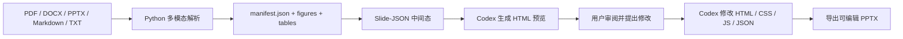

# ToPPT Document PPT Skill

> 面向论文与技术文档的「文档 -> HTML 预览 -> 可编辑 PPTX」生成工作流。上传或指定 PDF / DOCX / PPTX / Markdown 等文件后，先提取文本、图表与结构信息，生成可预览的 HTML 幻灯片，再由 Codex 按你的修改意见迭代页面，最后导出原生可编辑 PowerPoint。

[](https://www.python.org/)
[](https://developer.mozilla.org/en-US/docs/Web/JavaScript)
[](https://python-pptx.readthedocs.io/)
[](LICENSE)

## 项目简介

ToPPT 将传统的「论文转 Markdown 总结」升级为完整的演示文稿生产线：



核心原则：**HTML 用于预览和设计迭代，最终导出的 PPTX 尽量保持可编辑对象，而不是整页截图。**

## 功能特性

- 支持 PDF 论文的多模态解析，提取正文、图表、表格、标题、页码和坐标信息。
- 使用严格的 `document-ppt.slide.v1` Slide-JSON 作为中间态。
- 前端预览层使用纯 JavaScript，不使用 TypeScript。
- 支持生成 HTML-PPT 预览包，包含键盘翻页、缩略总览、演讲者备注、主题样式和导出入口。
- 支持「先预览，后修改，再导出」的交互流程：你在聊天中告诉 Codex 怎么改，Codex 直接修改生成的前端页面。
- 使用 `python-pptx` 导出原生 PPTX，文本框、图片、背景、装饰线等尽量保持 PowerPoint 可编辑。
- 预览服务支持上传 PDF、DOCX、PPTX、Markdown、TXT、JSON 等常见文件格式。

## 目录结构

```text
.
├── scripts/
│   ├── extract_multimodal_assets.py       # Phase 1: PDF 文本、图表、表格解析
│   ├── generate_slide_json.py             # Phase 2: manifest -> Slide-JSON
│   ├── create_agent_preview_bundle.py     # Phase 3: Slide-JSON -> HTML 预览包
│   ├── serve_preview.py                   # 本地预览、上传、请求记录、导出 API
│   └── compile_pptx.py                    # Phase 4: Slide-JSON -> 可编辑 PPTX
├── preview/                               # 通用预览运行时
├── schemas/slide-json.schema.json          # Slide-JSON Schema
├── docs/                                  # 阶段架构说明
├── tests/                                 # 单元测试
├── SKILL.md                               # Codex Skill 工作流说明
└── environment.yml                        # Conda 环境定义
```

生成目录如 `*_multimodal/`、`preview_runs/`、`_preview_uploads/`、`*_presentation.pptx` 已加入 `.gitignore`。

## 环境要求

- Windows、macOS 或 Linux
- Conda
- Python 3.12
- 浏览器，用于访问 `http://127.0.0.1:8765/`

推荐使用独立 Conda 环境 `ppt`，不要使用 `base` 环境。

```powershell
conda env create -f environment.yml
conda activate ppt
```

当前环境主要依赖：

- `pymupdf`
- `pdfplumber`
- `python-pptx`

如需运行开发测试，可额外安装 `pytest`。

## 快速开始

### 1. 提取论文多模态资产

```powershell
E:\Anaconda3\envs\ppt\python.exe .\scripts\extract_multimodal_assets.py `
  "E:\paper-reader\paper.pdf" `
  --output-dir .\paper_multimodal
```

输出目录示例：

```text
paper_multimodal/
├── manifest.json
├── extracted_text.md
└── assets/
    ├── figures/
    ├── tables/
    └── pages/
```

### 2. 生成 Slide-JSON

```powershell
E:\Anaconda3\envs\ppt\python.exe .\scripts\generate_slide_json.py `
  .\paper_multimodal\manifest.json `
  --output .\paper_slide_deck.json
```

没有配置 LLM 时，可以使用确定性预览模式：

```powershell
E:\Anaconda3\envs\ppt\python.exe .\scripts\generate_slide_json.py `
  .\paper_multimodal\manifest.json `
  --output .\paper_slide_deck.json `
  --dry-run
```

如需调用 LLM，请配置：

```powershell
$env:OPENAI_API_KEY="..."
$env:OPENAI_MODEL="..."
$env:OPENAI_BASE_URL="https://api.openai.com/v1"
```

### 3. 创建 HTML 预览包

```powershell
E:\Anaconda3\envs\ppt\python.exe .\scripts\create_agent_preview_bundle.py `
  .\paper_slide_deck.json `
  --output-dir .\preview_runs\paper_preview
```

生成的预览包包含：

```text
preview_runs/paper_preview/
├── index.html
├── styles.css
├── app.js
├── slide_deck.json
├── AGENT_NOTES.md
└── assets/
```

### 4. 启动本地预览

```powershell
E:\Anaconda3\envs\ppt\python.exe .\scripts\serve_preview.py `
  --host 127.0.0.1 `
  --port 8765 `
  --preview-dir .\preview_runs\paper_preview `
  --deck .\preview_runs\paper_preview\slide_deck.json
```

打开：

```text
http://127.0.0.1:8765/
```

### 5. 修改预览页面

推荐工作流：

1. 在浏览器中查看 HTML 预览。
2. 在 Codex 聊天中描述修改意见，例如：
   - `改成深色科技风`
   - `第 3 页图片放大，文字减少到 3 条`
   - `整体更像论文答辩 PPT`
3. Codex 修改生成目录中的 `index.html`、`styles.css`、`app.js` 或 `slide_deck.json`。
4. 刷新浏览器继续审阅。

页面右侧的请求框可用于记录修改意见，记录文件位于 `_preview_uploads/agent_requests/latest.json`。当前更稳定的方式是直接在 Codex 聊天中提出修改，由 Codex 修改 HTML 预览包。

### 6. 导出可编辑 PPTX

确认预览效果后再导出：

```powershell
E:\Anaconda3\envs\ppt\python.exe .\scripts\compile_pptx.py `
  .\preview_runs\paper_preview\slide_deck.json `
  --output .\paper_presentation.pptx
```

也可以在预览页面点击 `Export PPTX`。

导出的 PPTX 会尽量保持可编辑性：文字仍为文本框，图表仍为图片，主题背景、装饰线和基础版式会转换为 PowerPoint 对象。

## 端到端示例

```powershell
$PY="E:\Anaconda3\envs\ppt\python.exe"
$PDF="E:\paper-reader\paper.pdf"

& $PY .\scripts\extract_multimodal_assets.py $PDF --output-dir .\paper_multimodal
& $PY .\scripts\generate_slide_json.py .\paper_multimodal\manifest.json --output .\paper_slide_deck.json
& $PY .\scripts\create_agent_preview_bundle.py .\paper_slide_deck.json --output-dir .\preview_runs\paper_preview
& $PY .\scripts\serve_preview.py --host 127.0.0.1 --port 8765 --preview-dir .\preview_runs\paper_preview --deck .\preview_runs\paper_preview\slide_deck.json
```

打开 `http://127.0.0.1:8765/` 预览。

准备导出时运行：

```powershell
& $PY .\scripts\compile_pptx.py .\preview_runs\paper_preview\slide_deck.json --output .\paper_presentation.pptx
```

## Slide-JSON 协议

预览和导出共用 `document-ppt.slide.v1`。

简化结构如下：

```json
{
  "schema_version": "document-ppt.slide.v1",
  "deck": {
    "title": "Deck title",
    "source_manifest": "paper_multimodal/manifest.json",
    "theme": {
      "aspect_ratio": "16:9",
      "font_family": "Microsoft YaHei",
      "palette": {
        "background": "#F8FAFC",
        "foreground": "#111827",
        "accent": "#0F766E"
      }
    }
  },
  "slides": [
    {
      "id": "slide_01",
      "title": "Slide title",
      "layout": "visual-right",
      "bullets": [],
      "visuals": [],
      "speaker_notes": "",
      "transition": "fade"
    }
  ]
}
```

完整协议见 [schemas/slide-json.schema.json](schemas/slide-json.schema.json)。

## Codex Skill 使用方式

Skill 入口文件是 [SKILL.md](SKILL.md)。

本地安装路径示例：

```text
C:\Users\<you>\.codex\skills\toppt\SKILL.md
```

在 Codex 中调用：

```text
$toppt 帮我根据 "E:\paper-reader\paper.pdf" 生成 PPT
```

推荐交互节奏：

```text
1. 先让 toppt 解析文档并生成 HTML 预览。
2. 你查看浏览器预览后，在聊天中提出修改意见。
3. Codex 修改预览页面。
4. 你确认后，再让 Codex 导出 PPTX。
```

## 开发命令

Python 语法检查：

```powershell
E:\Anaconda3\envs\ppt\python.exe -m py_compile .\scripts\extract_multimodal_assets.py .\scripts\generate_slide_json.py .\scripts\create_agent_preview_bundle.py .\scripts\serve_preview.py .\scripts\compile_pptx.py
```

使用标准库运行测试：

```powershell
E:\Anaconda3\envs\ppt\python.exe -m unittest discover .\tests
```

如果安装了 `pytest`：

```powershell
E:\Anaconda3\envs\ppt\python.exe -m pytest
```

## 设计约束

- 前端逻辑必须保持纯 JavaScript。
- 文档解析、LLM 调度、预览服务和 PPTX 导出优先使用 Python。
- HTML 预览可以追求更强的视觉表达和动画效果。
- 最终 PPTX 导出应优先保证可编辑性，不默认使用整页截图方案。
- 生成物不进入 Git，以保持仓库干净。

## 常见问题

### `PyMuPDF is required`

请确认已激活 `ppt` 环境，或安装依赖：

```powershell
conda activate ppt
python -m pip install pymupdf pdfplumber python-pptx
```

### 预览中看不到图表

检查 `deck.source_manifest` 是否指向正确的 `manifest.json`，并确认对应 `asset_url` 文件存在。

### 导出的 PPT 和 HTML 不完全一致

PPTX 编译器会优先生成可编辑 PowerPoint 对象，而不是像素级截图。若样式有较大变化，请同步修改 `slide_deck.json` 后再运行 `compile_pptx.py`。

### 8765 端口被占用

换一个端口启动：

```powershell
E:\Anaconda3\envs\ppt\python.exe .\scripts\serve_preview.py --port 8766
```

## License

This project is licensed under the Apache License 2.0. See [LICENSE](LICENSE).
