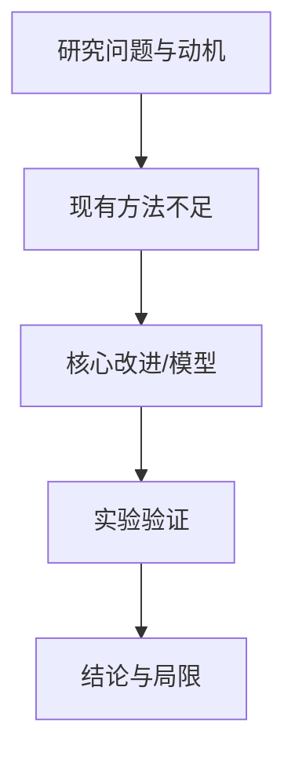

# 论文阅读报告模板

~~~markdown
# 《论文标题》阅读报告

## 论文叙事

## 论文关键创新点

## 论文结构框架图

## 作者对于改进点/创新点的叙述手段

## 作者如何证明改进有效

这一节必须插入论文中的关键实验表格。表格应尽量来自 `assets/tables/*.csv`，转换成 Markdown 表；若 CSV 抽取错位，则根据 PDF 正文和原表重建。每个表格前后都要解释：该实验验证哪个改进点、使用了什么指标、结果如何支持或削弱作者的主张。

### 表 X. 原论文表题（p.X）

| 模型/配置 | 指标1 | 指标2 | 复杂度 |
| --- | --- | --- | --- |
| Baseline |  |  |  |
| Proposed |  |  |  |

## 创新点

这一节用于罗列作者所有与创新相关的模型图和模块图，不只放一个总结构图。每个条目包含：图号、页码、图片、模块作用、是否原创、非原创时作者引用的参考文献编号。

### 创新点 1：模型/模块名称

- 图号与页码：Fig. X, p.X
- 作用：说明它解决什么问题，以及在整体方法中的位置。
- 原创性标注：原创 / 非原创，作者引用 [N] / 原文来源不清楚

## 总结与启发
~~~

报告应优先引用页码、章节名、图表编号、实验名和指标名。结构框架图可以是 Mermaid；创新点部分优先使用论文中抽取出的原图，并对非原创模块标注作者引用来源。
